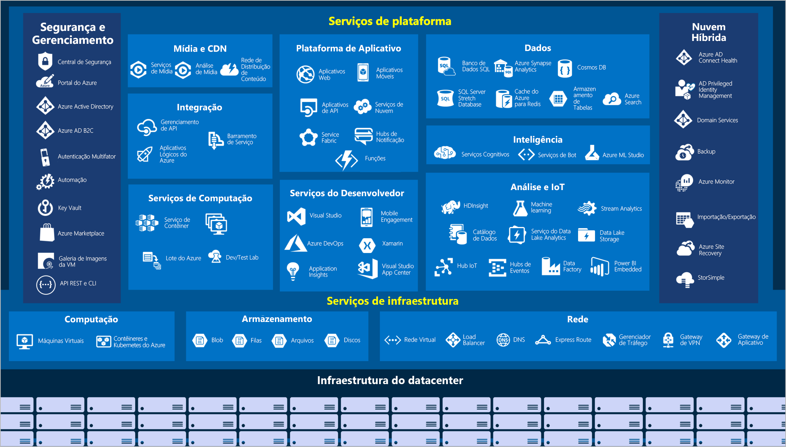

# Azure - Anotações #

Baseado na trilha de conhecimento [Princípios básicos do Azure](https://docs.microsoft.com/pt-br/learn/paths/az-900-describe-cloud-concepts/) do [Microsoft Learn](https://docs.microsoft.com/pt-br/learn).

Serviço de computação em nuvem da Microsoft. 

Serviços de computação em nuvem além do dinamismo de uso, geralmente são mais baratos qeu um servidor próprio, além de diversos recursos e serviços que podem ser utilizados sob-demanda. 

Azure é uma plataforma **gigantesca**. Em razão disso seus produtos e serviços foram separados em 8 categorias. São elas:

- Compute Services - Serviços de Computação
  - Virtual Machines
  - Containers
  - Serveless (Microservices)
- Cloud Storage - Armazenamento na nuvem
  - Compartilhamento de storage
  - Bancos de dados sob demanda
- Networking - Rede
  - Rede privada
  - Ambientes locais
- App Hosting - Hospedagem de Aplicações
- Artificial Intelligence - Inteligencia artificial
- Internet of   Things - Internet das Coisas
- Integration - Integrações
- Security - Segurança  
- BigData
- [DevOps][1]

[1]: <https://en.wikipedia.org/wiki/DevOps> "Conceito de DevOps (in english)"

## Visão dos serviços ##

---

## Sobre a computação em Nuvem ##
[^1]: SobreCloud

### Vantagens ###

- Alta performace
  - Sua plataforma/sistemas sempre ativos
  - Sem quedas aparentes
- Escalabilidade
  - Vertical: Aumentar a performace de hardware (CPU, memória RAM) numa VM
  - Horizontal: Aumentar o número de VMs
- Elasticidade: Com o dimensionamento automático os recursos são "elásticos", ou seja, podem crescer e reduzir baseado em suas necessidade e configurações.
- Agilidade: Plug in play. Configure e está ON e OK.
- Distribuição geográfica: Amplie as possibilidades com uma rede de servidores ao redor do mundo.
- Recuperação de desastres: Com a gama de redes de servidores e a distruição dos arquivos e configurações, a recuperação de dados é viável e pode ser feita de maneira transparente (dependendo de como criou sua arquitetura).

### Consumo e custos ###

***modelo baseado em consumo***: 
A computação em nuvem é inerentemente criada sob preços dinâmicos. Esse preços podem complicar o entendimento da precificação, porém dão uma gama de possibilidades e trazem justiça no uso. Portanto o preço será totalmente baseado no seu consumo. 

> **Importante** fique atento as configurações da sua aplicação. Use e abuse da plataforma de análise de custos (billing) da sua provedora de nuvem. Muitas delas possue possibilidade de alertas e gatilhos.

### Modelos de serviços em nuvem ###

| Modelo | Definição | Descrição |
|--------|-----------|-----------|
| IaaS   | Infraestrutura como Serviço | Contratação de infraestrutura na nuvem. Porém a manutenação da infra e a gestão dos serviços é toda do contratador. Por exemplo: Virtual Machines. |
| PaaS   | Plataforma como Serviço | A plataforma de nuvem (ex.: Azure) fornece uma plataforam pronta para a hospedagem de sua aplicação. Diversos serviços já pre-configurados e otimizados. Exemplo: Serviço de Aplicativos do Azure. |
| SaaS | Software como Serviço | A plataforma fornece uma série de softwares/serviços para consumo da sua aplicação. Pode ser um produto independente também. Por exemplo: Office 365. |
| Serveless | Computação "sem servidor" | Fornece possibilidade de entregar seus serviços e não se preocupar com a execução dele. A plataforma de nuvem fará toda a gestão, manuteção, escalabilidade e elasticidade baseado na demanda do seu serviço (obviamente dependendo de configurações que determinar e da arquitetura da sua aplicação). |

### Tipos de computação em nuvem ###
- Pública
  - Disponibilidade geral
- Privada
  - Disponibilidade exclusiva, configurável e limitável
- Híbrida
  - Misto entre uma nuvem pública geral e exclusiva. Exemplo: Aplicação necessita de uma segurança e controle total de determinada rotira, porém necessita também de serviços públicos disponíveis pela plataforma de cloud.

### Conhecendo a arquitetura do Azure ###

Hierarquia da organizaçãodos recursos
- 1 **Grupos de Gerenciamento**
- 1.1 ***Assinaturas***
- 1.1.1 Grupos de recursos
- 1.1.1.1 Recursos

As assinaturas do Azure são unidade lógica (unidade de acesso) de acesso e uso do Azure vinculadas a uma conta.

Nas assinaturas é possível criar limites de cobrança e de acesso. Ou seja, caso queira limitar a assinatura a determinado valor atingido ou a determinados níveis de uso e acesso.

As assinaturas podem ser usadas, por exemplo: Distinguindo ambientes (produção, testes, homologação, beta), departamentos, projetos, etapas de um projeto, equipes etc. É muito útil na gestão do Azure, pois relatórios de custos podem ser gerados baseados nas assinaturas, e assim compreender todo o processo de uso/consumo.

Na fatura pode-se criar uma subdivisão pelas assinaturas, criando assim sessões na fatura. Por exemplo: Assinatura 1 gastou x reais, assinatura 2 y reais, etc.
Na gestão de custos/fatura é possível criar perfis de cobrança. Esse perfil gerará faturas e formas de pagamento separadas. Os perfis agrupam diversas assinaturas. Por tanto pode-se separar em, por exemplo: Custos de Produção (sessão assinatura Aplicação, sessão assinatura Mobile).

Portanto ao configurar os custos do Azure é importante levar em consideração essa organização para melhor proveito dos dados e da gestão de custos.

Os grupos de gerenciamento fornecem uma camada acima das assinaturas para gestão de acessos e segurança. Portanto um grupo de gerenciamento pode ser o guia de outros grupos ou assinaturas.

### Hierarquia ###

Um recurso do Azure é um **item gerenciável** disponibilizado por meio do Azure. VMs (máquinas virtuais), contas de armazenamento, aplicativos Web, bancos de dados e redes virtuais são exemplos de recursos.

Um grupo de recursos é a divisão lógica de recursos, ou seja, um agrupamento baseado nos critérios que desejar de diversos recursos.

---
Regiões e Zonas de Disponibilidade

Os recursos do Azure estão hospedados em `Regiões`. 
As regiões podem possuir `Zonas de Disponibilidades`, que são divisões entre data centers da mesma Zona. 

Existem também regiões especiais (Governamentais e parceria com DataCenter na China).

Existem também os `Pares de região`: que são réplicas de uma zona em outra zona distante geograficamente. Em casos de alguma catastrofe ou problema temporario afete determinada região existe a outra para fins de manutenção das aplicações. 

---
Serviço de Aplicativo

Plataforma para criação e hospedagem de serviços sem a necessidade de infraestrutura. Por exemplo: Aplicações, APIs, Sites..

Azure Marketplace

Loja que hospeda aplicações já preconfiguradas e otimizadas para o uso na Azure.
